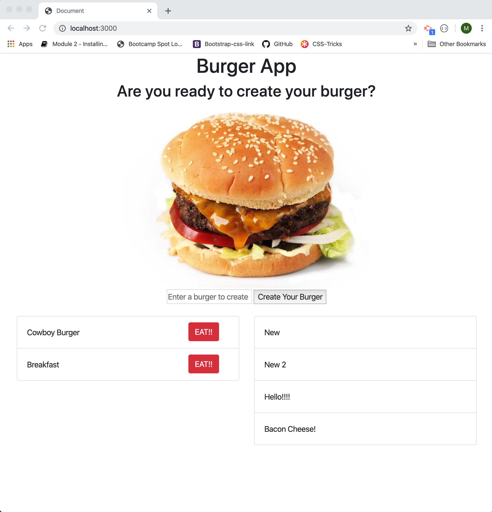

# Burger-App-sequelize-node-express

This project is a homework assignemnt for section 13 of Coding Bootcamp

### Deployed App link:

https://burger-app-hw13.herokuapp.com/

### Description

This Burger App is designed to use Sequelize to create a Table in a mySQL database and add and update items in the table.

This takes a user input via text input and creates a record in the table with a text column and a Boolean value of false along with an ID, create time, and update time which sequelize generates by default.

### Photo

### Creation

This project was bootstraped from a Node-Express-Sequelize template from our instructor Brian Bartholomew -bcbrian
